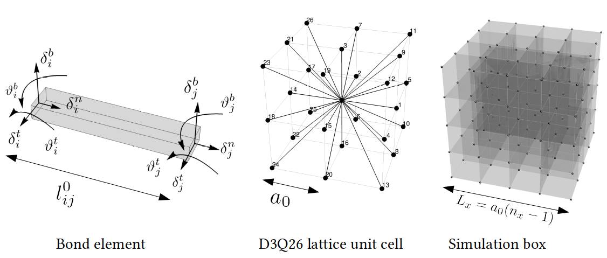

## [Back to home page](/index)
---
## Projects

### CELADRO-3D & CELADRO-3D-CUDA

3D multiphase field model based on finite difference methods with CUDA programming for GPU acceleration. This software package can efficiently simulate the collective dynamics of active, soft matter and biological cells, utilizing high-performance computing (HPC) for scalable and computationally intensive simulations. Links to GitHub projects: 

[CELADRO-3D](https://github.com/siavashmonfared/celadro_three_dimensional)

[CELADRO-3D-CUDA](https://github.com/siavashmonfared/CELADRO-3D-CUDA)

<iframe width="560" height="315" src="/movies/3d_mpf_simulation.gif" frameborder="0" allowfullscreen></iframe>

### CG-LGDFT-3D-MPI & CG-LGDFT-2D-MPI
A 3D coarse-grained lattice-gas density functional model using finite-difference techniques on a simple cubic lattice. Implemented parallel processing with Message Passing Interface (MPI) for domain decomposition, allowing for distributed computing across multiple nodes. This software framework was applied to explore the thermodynamics and statistical mechanics of confined fluids, providing scalable solutions for large-scale simulations. Links to GitHub projects: 

[CG-LGDFT-2D-MPI](https://github.com/siavashmonfared/CGDFT_2D)

<iframe width="560" height="315" src="/movies/CGDFT_2D.gif" frameborder="0" allowfullscreen></iframe>

### LEM-3D-MPI
A 3D discrete computational solid mechanics framework using finite differences and Message Passing Interface (MPI) for parallel processing and domain decomposition. The software is specifically designed to analyze highly heterogeneous solids by incorporating multiple interacting random fields, making it suitable for studying complex mechanical behaviors in materials with non-uniform properties.

