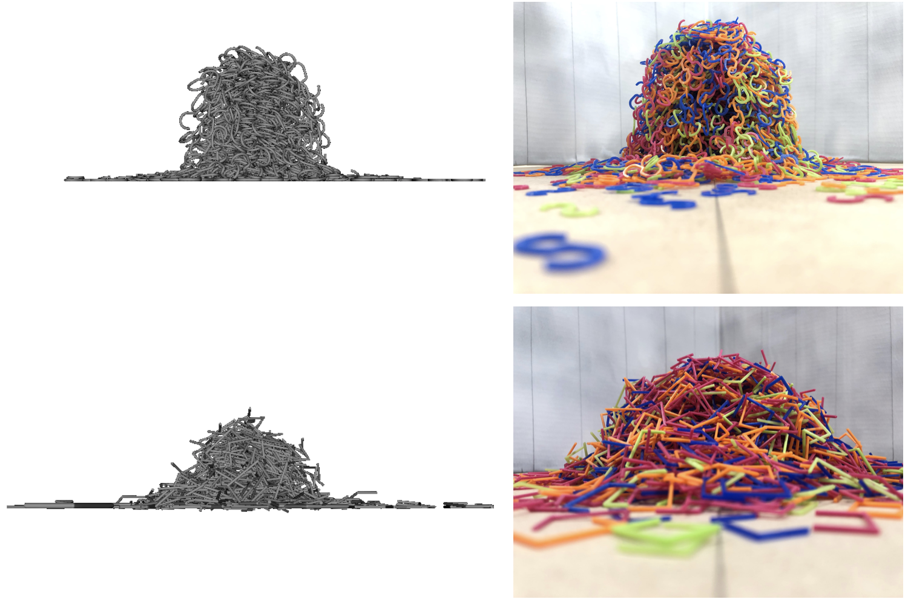

## Research

### Cell & cellular bio-physics

The mechanical interactions between a cell and its environment play a dominant role in many biological processes including gene expression and morphogenesis. Furthermore, cellular interactions and collective cell migration are not only critical to tissue regeneration but also key to cancer metastasis and tumor invasion. Although recent conceptual, theoretical and computational advances have provided access to mechanical fields, e.g. forces and displacements, in two-dimensions, the three dimensional fields remain inaccessible

<iframe width="560" height="315" src="/movies/substrate.mov" frameborder="0" allowfullscreen></iframe>

### Physics of confined fluids & capillary phase transition

The behavior of bulk fluid contrast significantly with that of a confined fluid. This is a consequence of pore morphology, topology and the strength of fluid-solid interactions that alter the energy landscape of a fluid. The effect of confinement on fluid behavior is of interest for a range of scientific and engineering applications. In the case of disordered porous materials, the effect of underlying effective random fields induced by structural and/or chemical disorder on degree of confinement, nature of phase transition, and critical exponents are still unclear.

<iframe width="560" height="315" src="/movies/xsec.mov" frameborder="0" allowfullscreen></iframe>

### Granular physics: Non-convex particle interactions & wet systems

Considering the large carbon footprint of cement production as building materials, jammed granular structures made from entangled non-convex particles can inspire a new class of building materials. While recent studies have demonstrated the ability of such structures to carry tensile forces, the interplay of particle topology, interlocking capability and mechanical behavior remains to be fully unraveled.

<iframe width="560" height="315" src="/movies/Ng500s.mov" frameborder="0" allowfullscreen></iframe>

Despite well over 200 years since the pioneering work of Young and Laplace, a unified theoretical framework to model capillary pressure evolution in disordered porous media has yet to emerge. Part of the challenge for investigating the behavior of wet granular materials lies in the complex texturing of liquid in a disordered porous structure. This includes the formation, growth and coalescence of liquid clusters in granular systems. For the case of unsaturated poromechanics, any rigorous approach requires bringing together a description for solid(s) that can account for heterogeneity and anisotropy as well as a fluid description that honors the effects of confinement, temperature and the strength of fluid-solid interactions while providing access to the capillary pressure field inside the pore domain.

### Mechanics & poromechanics of highly heterogeneous solids
Poromechanics is dedicated to the modeling and prediction of how porous materials deform in response to various external loadings. These loadings range from fluid–solid interactions by a variety of pressures at the liquid–solid interface to complex physical chemistry phenomena at the pore scale that produce a mechanical deformation (including fracture) of the solid. The classical backbone of poromechanics is based on continuum theories, ever since Maurice A. Biot defined the kinematics of deformation of the skeleton within the classical continuum mechanics framework as the refer- ence for the description of the flow of the liquid phase through the pore space. Although continuum poromechanics theory has entered and transformed many engineering fields ranging from civil and environmental engineering and geophysics applications to biomechanics and the food industry, the intrinsic limitations of the theory relate to the very foundations of the continuum model, including scale separability and its impact on the relevance of the differential operators defining the momentum balance and displacement–strain operators. We propose a discrete re-formulation of the theory that can be applied to porous materials with a highly heterogeneous solid while accounting for anisotropy.

