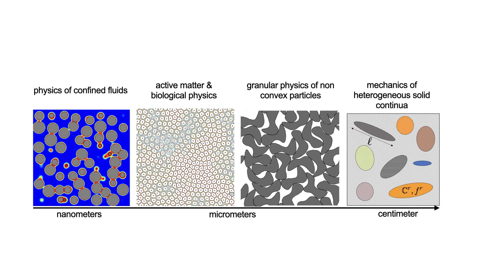
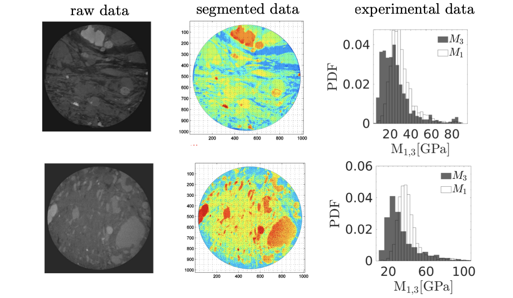

## [Back to home page](/index)

## Research

### Active matter & Biological Physics

Understanding how multi-cellular life emerges from a single cell is yet to be fully understood. This processes is a highly orchestrated process where cell can collectively form dynamic patterns without any central guidance. I develop theoretical and high performance computational models to decipher the complex interplay of nonequilibrium statistical physics of living cells with biological functions accounting for various sources that drive a living system away from equilibrium. 

<iframe width="560" height="315" src="/movies/3d_mpf_simulation.gif" frameborder="0" allowfullscreen></iframe>

### Physics of confined fluids & capillary phase transition

The behavior of bulk fluid contrast significantly with that of a confined fluid. This is a consequence of pore morphology, topology and the strength of fluid-solid interactions that alter the energy landscape of a fluid. The effect of confinement on fluid behavior is of interest for a range of scientific and engineering applications. I develop high performance computational models to study this phenomane accounting for various sources of structural and/or materials disorder. 

<iframe width="560" height="315" src="/movies/CGDFT_2D.gif" frameborder="0" allowfullscreen></iframe>

### Granular physics

Granular matter are one of the most ubiquitous materials on earth. The interplay of a particle shape; packing characteristics and its physical behavior is not fully deciphered. I am interested in understanding how topology of a particle can give rise to very interesting collective behavior not typically associated with classical - convex shaped - granular matter.  

<iframe width="560" height="315" src="/movies/staple_shaped.gif" frameborder="0" allowfullscreen></iframe>
<iframe width="560" height="315" src="/movies/sshaped.gif" frameborder="0" allowfullscreen></iframe>

### Mechanics highly heterogeneous solids

Continuum based modeling approaches have limited capabilities to capture the spatial distribution of solid constituents and their mechanical interactions. Primarily built on Eshelby's inclusion problem and mean-field based homogenization methods, continuum micromechanics approaches reduce the spatial distribution of the solid constituents and their mechanical interactions to effective fields. Furthermore, perturbation based solutions in statistical continuum mechanics are limited to small fluctuations in mechanical properties and thus unable to capture heavy-tailed distributions characteristics of highly heterogeneous media. For these materials with the length scale of observation often on par with that of the inclusions, defining a representative elementary volume that satisfies scale separability - a requirement for any continuum approach - becomes an impractical task. In this vein, we developed a discrete theoretical and computational framework that addresses the limitations encountered in the continuum approach.

<!--Poromechanics is dedicated to the modeling and prediction of how porous materials deform in response to various external loadings. These loadings range from fluid–solid interactions by a variety of pressures at the liquid–solid interface to complex physical chemistry phenomena at the pore scale that produce a mechanical deformation (including fracture) of the solid. The classical backbone of poromechanics is based on continuum theories, ever since Maurice A. Biot defined the kinematics of deformation of the skeleton within the classical continuum mechanics framework as the refer- ence for the description of the flow of the liquid phase through the pore space. Although continuum poromechanics theory has entered and transformed many engineering fields ranging from civil and environmental engineering and geophysics applications to biomechanics and the food industry, the intrinsic limitations of the theory relate to the very foundations of the continuum model, including scale separability and its impact on the relevance of the differential operators defining the momentum balance and displacement–strain operators. To address these limitations, we proposed a discrete re-formulation of the theory that can be applied to porous materials with a highly heterogeneous solid while accounting for anisotropy.!-->

